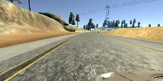
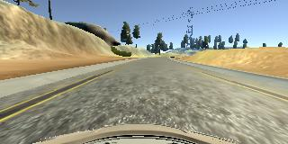
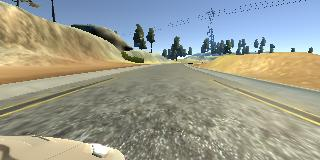

Self-Driving Behavioral Cloning
---
The goals / steps of this project are the following:
* Use the simulator to collect data of good driving behavior 
* Design, train and validate a model that predicts a steering angle from image data
* Use the model to drive the vehicle autonomously around the first track in the simulator. The vehicle should remain on the road for an entire loop around the track.
* Summarize the results with a written report

[//]: # (Image References)

[image1]: ./left_2017_03_14_22_20_28_108.jpg "Left Camera"
[image2]: ./center_2017_03_14_22_20_28_108.jpg "Center Camera"
[image3]: ./right_2017_03_14_22_20_28_108.jpg "Right Camera"

### Dependencies
This lab requires:

* [CarND Term1 Starter Kit](https://github.com/udacity/CarND-Term1-Starter-Kit)

The lab enviroment can be created with CarND Term1 Starter Kit. Click [here](https://github.com/udacity/CarND-Term1-Starter-Kit/blob/master/README.md) for the details.

### Data collection

The driving simulator is pretty straightforward to use. But you still probably want to do a couple of practice runs around the tracks before you hit the recording button. When recording, you might want to divide the track into smaller segments if you run into memory issues and/or saving image files.

To achieve the goal of being able to autonomously drive the simulator, I collected about 16,000 images (left, center, right) for Track 1, and more than 18,000 images for Track 2. 

### Model design and training

Here we need to design a model that predicts a steering angle. Since Keras is used for the project, it is really easy to experiment with different modesl. I started with a simple model with no convolutional layers. After a few epochs of training, it became obvious pretty quickly that this is not going to work.

Because of the wide publicity and availability of NVidia's end-to-end driving paper, I immediately pivoted to use the NVidia model, which has five (5) convolutional layers and four (4) fully connected layers as shown in this [architecture diagram](https://devblogs.nvidia.com/parallelforall/wp-content/uploads/2016/08/cnn-architecture.png)

```python
# five conv layers
model.add(Convolution2D(24, 5, 5, subsample=(2, 2), border_mode='valid'))
model.add(Activation('relu'))
model.add(Convolution2D(36, 5, 5, subsample=(2, 2), border_mode='valid'))
model.add(Activation('relu'))
model.add(Convolution2D(48, 5, 5, subsample=(2, 2), border_mode='valid'))
model.add(Activation('relu'))
model.add(Convolution2D(64, 3, 3, subsample=(1, 1), border_mode='valid'))
model.add(Activation('relu'))
model.add(Convolution2D(64, 3, 3, subsample=(1, 1), border_mode='valid'))
# four fully connected layers
model.add(Dense(1164, activation='relu'))
model.add(Dense(100))
model.add(Activation('relu'))
model.add(Dense(50))
model.add(Activation('relu'))
model.add(Dense(10))
model.add(Activation('relu'))
```

#### Image cropping and normalization

The camera images recorded are 160x320 with 3 channels (RGB). But if you open some of images, you will notice that both the top and bottom contains some useless information that does not contribute to predicting steering angles. Initial training runs corroborated this hunch. So it makes sense to crop out a band of pixels from the top (mostly skies and trees) and a bottom (just dashboard). After some trial and error, I settled on cropping 50 pixels from the top and 20 from the bottom. This is done with a Keras layer called Cropping2D. 

```python
model.add(Cropping2D(cropping=((50, 20), (0, 0)), input_shape=(160, 320, ch)))
```

Another trick is to normalize your training data. As typical for image input, you can use normalization to tranform your data into range of (-0.5, 0.5). This is done by a Keras lamda layer:

```python
model.add(Lambda(lambda x: x/255 - .5))
```

#### Data augmentation

The steering angles recorded can be thought of as using the center camera looking straight as its reference axis. In other words, a steering angle of 0.0 means driving straight ahead. A negative steering angle means the car is steering to the left. A positive angle steers the car to the right. If you use just the center camera images for training, your trained model might only see a lot of zero steering angle (for driving straight) and therefore do not know enough how to handle left or right turns. 

With only the center camera images, I ran into overfitting where training loss is small but validation loss is still large. So I need to get more training data, i.e. augment my data set.

So to augment the training data, I made use of both left and right camera images. For left camera images, I applied a positive bias to the steering angle, i.e. to make the car steer to the right. Vice versa for right camera images.

```python
center_angle = float(batch_sample[3])
left_angle = center_angle + 0.25
right_angle = center_angle - 0.25
```
To provide an example of the kind of images that were captured, shown below are three images from left, center and right camera respectively. The corresponding steering angle is 0.4112581, meaning that the car is steering to the right. As you can see from the center image, that is exactly what's happening, the car is trying to make a slight right turn around the curve ahead. The right image seems to show that the car is straight-facing the road and implies that a smaller steering angle should be applied. The left image implies we need to add a small value to the center steering angle.  

  

Some other commonly-used data augmentation techiques for images include random-brightness, translating/sheering, applying random shadows etc. I did not have to use these techniques for this project. 

#### Data generator

When you have a lot of images as your training data, it is usually impractical to load all of them at once and feed them through your training pipeline. What you typically do is to read a sub-set of data and optionally apply your data augmentation then feed that to your optimizer. This facility is called data generator. If you introduce randomness to your data augmentation algorithms, the data generator could in-theory produce un-limited amount of training data to your pipeline. Here is my data generator:
```python
def generator(samples, batch_size=32):
    num_samples = len(samples)
    while 1: # Loop forever so the generator never terminates
        random.shuffle(samples)
        for offset in range(0, num_samples, batch_size):
            batch_samples = samples[offset:offset+batch_size]

            images = []
            angles = []
            for batch_sample in batch_samples:
                name = '../data/IMG/'+batch_sample[0].split('/')[-1]
                center_image = cv2.imread(name)
                center_angle = float(batch_sample[3])
                images.append(center_image)
                angles.append(center_angle)
                # left camera
                name = '../data/IMG/'+batch_sample[1].split('/')[-1]
                left_image = cv2.imread(name)
                left_angle = center_angle + 0.25
                images.append(left_image)
                angles.append(left_angle)
                # right camera
                name = '../data/IMG/'+batch_sample[2].split('/')[-1]
                right_image = cv2.imread(name)
                right_angle = center_angle - 0.25
                images.append(right_image)
                angles.append(right_angle)

            X_train = np.array(images)
            y_train = np.array(angles)
            yield sklearn.utils.shuffle(X_train, y_train)
```

#### Training

The Keras model's output is a single number, i.e. steering angle. So we will just use a Dense(1) layer here.

Predicting a steering angle is a regression problem, a "mean squared error" loss function can be used here. And an 'adam' optimizer is used to train the model.

```python
model.add(Dense(1))
model.compile(loss='mse', optimizer='adam')
```

## Result
A video recording of autonomous driving with the model on Track 1 is shown in [video.mp4](https://github.com/yadongliu/Self-Driving-Behavior-Cloning/blob/master/video.mp4)

For Track 2, a recording is shown in [videotrack2.mp4](https://github.com/yadongliu/Self-Driving-Behavior-Cloning/blob/master/videotrack2.mp4)
